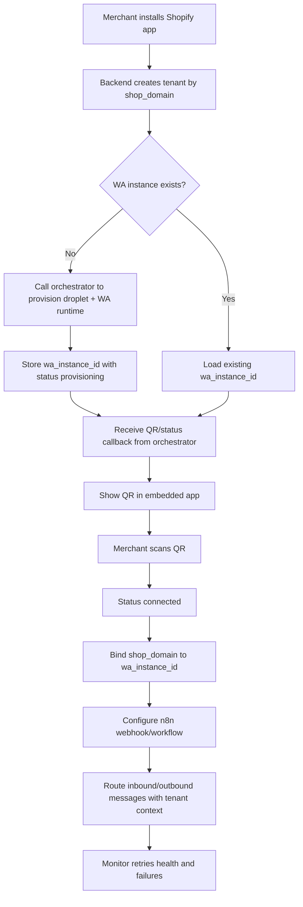

# Shopify + WhatsApp Linking Plan (Concise)

## Plan
1. **Install + Identify**
   - On Shopify app install, create tenant by `shop_domain` and store token.
2. **Provision WA Instance**
   - If no instance exists, orchestrator creates droplet + WhatsApp runtime.
   - Save `wa_instance_id` with status `provisioning`.
3. **QR Connect**
   - Orchestrator sends QR/status callbacks.
   - Merchant scans QR in embedded app; status becomes `connected`.
4. **Bind Routing**
   - Enforce `shop_domain <-> wa_instance_id` mapping (1:1 for MVP).
   - Route all inbound/outbound messages via this mapping.
5. **Connect n8n**
   - Save tenant-specific n8n webhook/workflow config.
   - Forward normalized events with tenant context.
6. **Secure Linking**
   - Use signed, short-lived link tokens for create/link/callback calls.
   - Enforce tenant isolation and idempotency.
7. **MVP Guardrails**
   - Add retries, health checks, reconnect flow, uninstall cleanup.
   - Track: install-to-connected rate, message success rate, retry/failure rate.

## Workflow (Mermaid)

